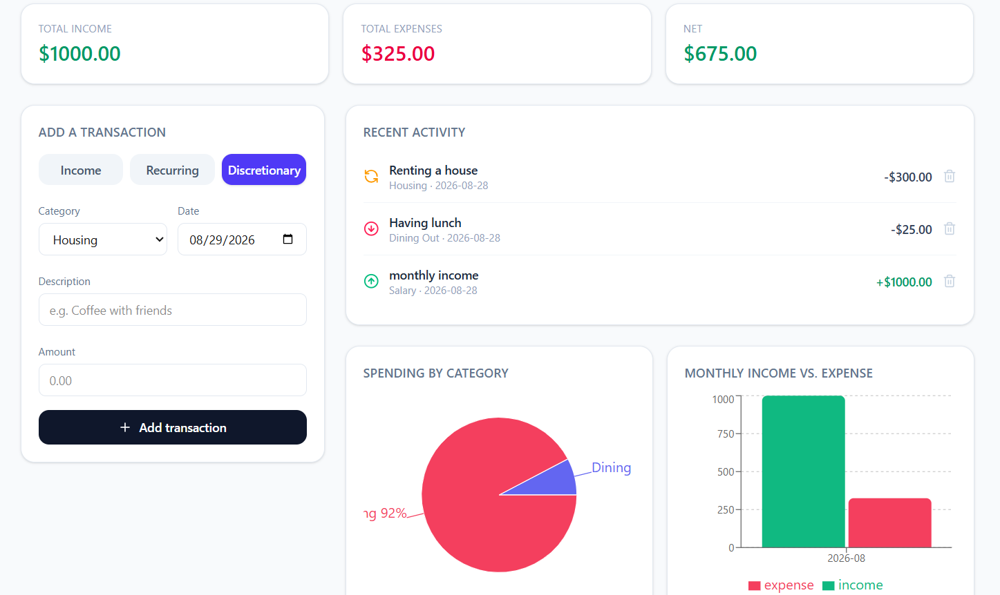

# Storytelling Budgeter

An AI-powered personal finance app. Log your income and expenses, see them
visualized, and get an AI-written narrative report about your spending —
in the voice of "The Encouraging Mentor," "The Data-Driven Analyst," and more.

Built with **Next.js 16 (App Router) + TypeScript + Tailwind CSS**, charts via
**Recharts**, and narrative generation via **OpenRouter**
(free model router, no credit card and no payment ever required), called
from a secure Next.js server route (your API key never reaches the browser).

## Features implemented (matches the proposal)

- Dynamic transaction form (income / recurring / discretionary, categorized)
- AI narrative synthesis with 4 selectable tones
- Visual analytics: spending-by-category pie chart, monthly income vs.
  expense bar chart
- Session persistence via `localStorage` (works immediately, no database
  setup required)

## 1. Run it locally

```bash
npm install
cp .env.example .env.local   # then paste your OpenRouter API key
npm run dev
```

Open http://localhost:3000.

Get a free API key at https://openrouter.ai — sign up, then go to
**Settings → Keys → Create Key** (no credit card, no payment ever
required) — it goes in `.env.local` as `OPENROUTER_API_KEY`.
This file is already git-ignored, so the key never gets committed.

## 2. Deploy to Vercel

**Option A — Vercel CLI (fastest)**

```bash
npm i -g vercel
vercel
```

Follow the prompts (link/create a project). Then set your API key:

```bash
vercel env add OPENROUTER_API_KEY
```

Paste your key when prompted, choose all environments, then:

```bash
vercel --prod
```

**Option B — GitHub + Vercel dashboard**

1. Push this folder to a new GitHub repo.
2. Go to https://vercel.com/new and import the repo. Vercel auto-detects
   Next.js — no config needed.
3. Before the first deploy (or right after), go to
   **Project → Settings → Environment Variables** and add:
   - Key: `OPENROUTER_API_KEY`
   - Value: your free key from https://openrouter.ai
   - Apply to Production, Preview, and Development
4. Deploy (or redeploy so the env var takes effect).

That's it — the app is live on your `*.vercel.app` URL.

## 3. Where things live

```
src/
  app/
    page.tsx                    # dashboard (client component, wires everything up)
    api/narrative/route.ts      # server route -> calls OpenRouter
    layout.tsx, globals.css
  components/
    TransactionForm.tsx         # dynamic input form
    TransactionList.tsx         # recent activity list
    SpendingCharts.tsx          # Recharts pie + bar charts
    NarrativeReport.tsx         # tone picker + AI report display
  lib/
    types.ts                    # Transaction, tones, categories
    storage.ts                  # localStorage persistence helpers
```

## 4. Website address
https://storytelling-budgeter.vercel.app


## 5. Image of project



